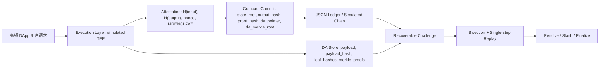
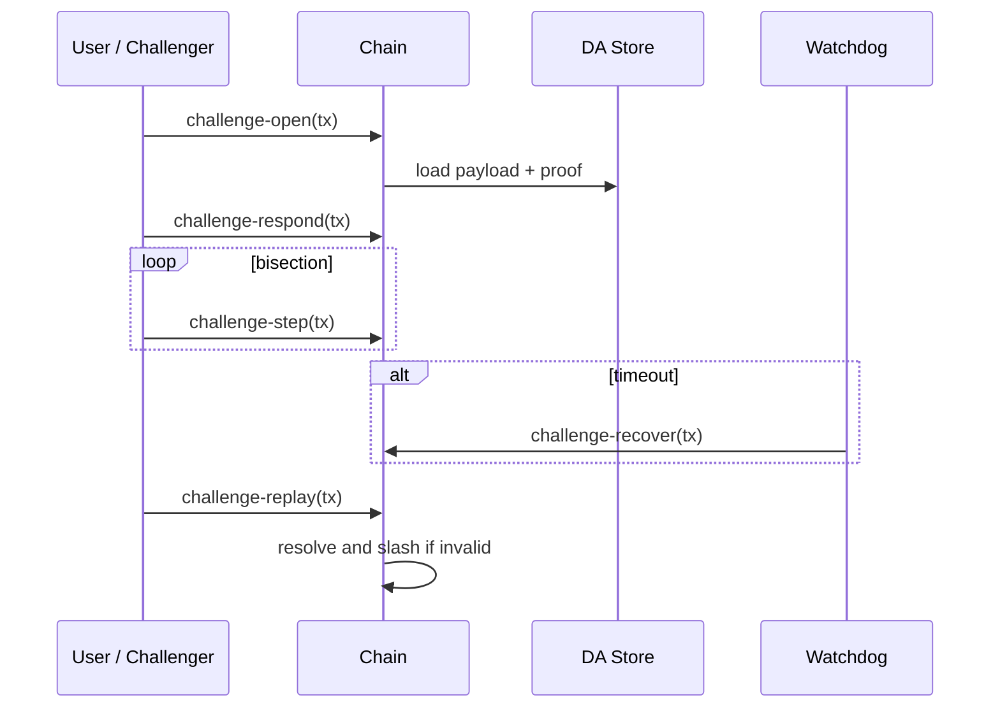
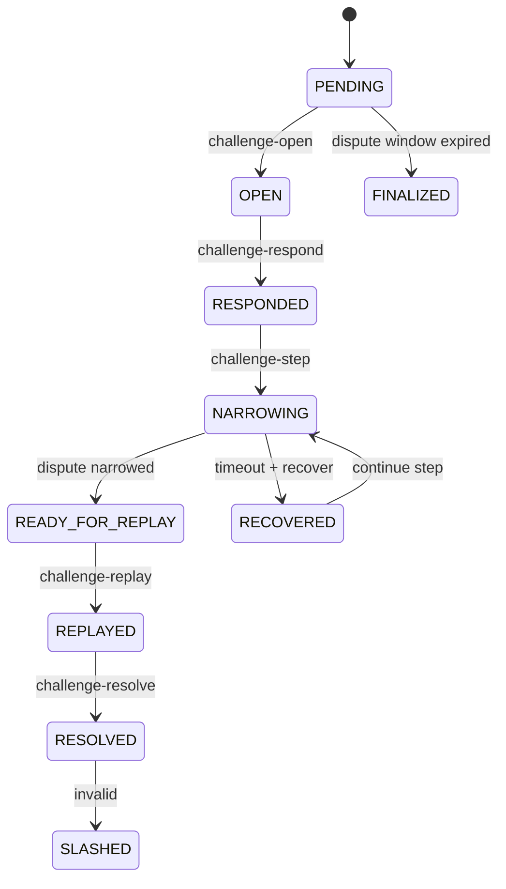

# 系统设计说明

## 架构图



## 数据结构

### Commit

```json
{
  "state_root": "...",
  "output_hash": "...",
  "proof_hash": "...",
  "da_pointer": "...",
  "da_merkle_root": "..."
}
```

### DA Entry

```json
{
  "da_pointer": "...",
  "payload": {"prompt": "...", "response": "...", "attestation": "..."},
  "payload_hash": "...",
  "leaf_hashes": {"prompt": "...", "response": "..."},
  "merkle_root": "...",
  "merkle_proofs": {"response": [{"position": "left", "hash": "..."}]}
}
```

### Challenge Evidence

```json
{
  "da_status": {"available": true, "valid": true, "reason": "da_proof_valid"},
  "mismatch_types": ["response_mismatch"],
  "target_step": 2,
  "expected_hash": "...",
  "claimed_hash": "..."
}
```

## 协议流程



## 状态机


