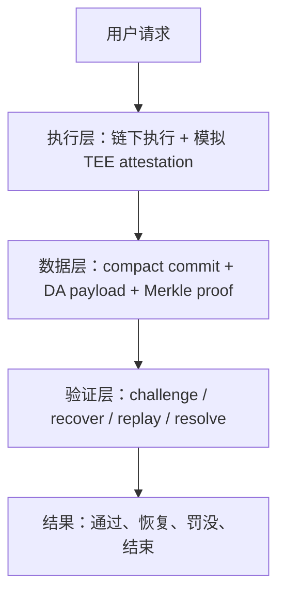

# 项目通俗介绍与完整汇报文档

## 1. 这是什么项目

这是一个围绕 **Hybrid TEE-Rollup** 的研究型原型项目。

如果用一句最容易理解的话来概括，这个项目想解决的是：

> 当一个区块链应用的交互非常频繁时，怎么在不牺牲安全性的前提下，把大量计算放到链下做掉，同时保留“出了问题还能查、还能追责、还能恢复”的能力。

这个问题特别适合高频 DApp 场景，比如：

- 元宇宙里的连续状态更新
- 去中心化社交里的点赞、评论、转发、关系变更
- 链上 AI / 推理请求的批量处理

这些场景有一个共同特点：

1. 请求很多；
2. 单次请求价值不一定高，但总量很大；
3. 如果每一步都完全放到链上执行，成本会很高、吞吐会很差；
4. 但如果全都放到链下，又会担心结果是不是被篡改。

所以这个项目研究的是一种折中路线：

- **执行尽量放链下**
- **提交尽量变轻**
- **出现异常时仍然可以验证、挑战和仲裁**

当前项目的论文主线已经收敛为：

> 在已有 Hybrid TEE-Rollup 思路下，研究交互式挑战在异常场景中的可恢复性，并量化轻量 DA 提交对高频 DApp 的成本收益。

---

## 2. 为什么要做这个项目

### 2.1 传统链上执行的问题

如果把所有请求都直接上链执行，会遇到三个问题：

1. **慢**  
   链上吞吐有限，大量高频请求会拥堵。

2. **贵**  
   每一笔请求都要为链上计算和数据存储付费。

3. **不适合高频场景**  
   高频 DApp 不是偶尔做一件大事，而是持续不断地做很多小事。

---

### 2.2 纯链下执行的问题

如果完全放到链下执行，虽然快了、便宜了，但会产生新的问题：

1. 谁来保证执行结果是真的？
2. 如果执行者作恶怎么办？
3. 如果挑战过程中有人超时、失联、故意拖延怎么办？

也就是说，性能提上来了，但可信性和可验证性可能掉下去了。

---

### 2.3 这个项目想找的平衡点

这个项目尝试找到一个中间方案：

- 用 **TEE** 给链下执行增加可信性；
- 用 **Rollup** 的思路把很多请求打包提交；
- 用 **DA（Data Availability，数据可用性）** 把完整数据放到更便宜的位置；
- 用 **Optimistic Challenge** 在异常情况下进行挑战和仲裁；
- 再进一步研究一个更现实的问题：
  - 如果挑战流程自己也出问题了，比如超时、中断、数据缺失，系统还能不能恢复并继续推进？

这就是本项目最重要的研究切口。

---

## 3. 用一个比喻来理解整个项目

可以把这个系统想成一个“**链下办事、链上留痕、出事可复核**”的流程。

### 角色类比

- **TEE 执行器**：像一个带封条的计算柜台  
  它负责真正干活，并给结果盖一个“这是我算出来的”章。

- **Rollup 提交**：像只把摘要交给总台  
  不是把整份材料全部交上去，而是只交一个精简版摘要。

- **DA 存储**：像把完整档案放进资料库  
  平时不占链上最贵的位置，但需要的时候随时能调出来。

- **Challenge 机制**：像有人质疑“你这份摘要不对”  
  这时就要逐步翻资料、对步骤、定位问题。

- **Recover 机制**：像复核过程中有人卡住了，还能恢复流程继续查  
  这是本项目相对更有特色的地方。

---

## 4. 项目的核心思路

这个项目不是做一个完整商业系统，而是做一个**可以运行、可以实验、可以写论文**的研究原型。

它主要研究两件事：

### 4.1 可恢复挑战

普通的 optimistic challenge 往往关注：

- 能不能发现错误；
- 能不能定位错误；
- 能不能做出最终仲裁。

但现实里还有一个很重要的问题：

> 如果挑战过程中有人超时、会话中断、轨迹不一致、数据缺失，整个流程会不会直接卡死？

本项目研究的是：

> 不只是“能挑战”，而是“挑战流程在异常情况下还能恢复并继续推进”。

---

### 4.2 轻量提交 + DA 降本

另一个问题是成本。

如果完整数据都放到链上，太贵。  
所以项目采用：

- 链上只放 **compact commit**
- 完整 payload 放到 **DA 层**
- 需要验证时，再通过 hash、Merkle proof 和 challenge evidence 把两边接起来

这样做的目标是：

1. 平时提交更轻；
2. 发生异常时仍然能追溯；
3. 随着 payload 增大和 batch 增大，成本收益更明显。

---

## 5. 系统整体结构

整个系统可以拆成三层。

---

### 5.1 执行层

执行层负责真正处理请求。

当前实现方式：

- 使用 deterministic mock model 或可选 Ollama 后端做链下执行；
- 生成 simulated TEE attestation；
- 把输入、输出、nonce、执行环境信息绑在一起。

通俗理解就是：

> “我不把计算放链上做，但我会给这个结果附上一份可校验的证明，说明结果是谁算的、算的是哪份输入。”

对应代码核心在：

- [model.py](/E:/项目/project_code/tee_rollup_demo/model.py)
- [attestation.py](/E:/项目/project_code/tee_rollup_demo/attestation.py)

---

### 5.2 数据层

数据层的目标是：**不把所有东西都塞上链，但又不能让验证路径断掉。**

当前设计里，链上提交的是一个轻量 commit，里面包括：

- `state_root`
- `output_hash`
- `proof_hash`
- `da_pointer`
- `da_merkle_root`

DA 层保存完整数据，并提供：

- `payload_hash`
- `leaf_hashes`
- `merkle_root`
- `merkle_proofs`

通俗理解是：

> 链上只放“目录和摘要”，完整正文放在更便宜的仓库里；  
> 但为了防止仓库内容被偷偷改掉，还要给仓库内容做一套可验证证明。

对应代码核心在：

- [ledger.py](/E:/项目/project_code/tee_rollup_demo/ledger.py)

---

### 5.3 验证层

验证层是本项目最关键的部分之一。

当前已经实现的挑战流程包括：

- `challenge-open`
- `challenge-respond`
- `challenge-step`
- `challenge-recover`
- `challenge-replay`
- `challenge-resolve`

这意味着系统不仅能：

1. 打开挑战；
2. 让对方应答；
3. 通过二分方式缩小争议范围；
4. 在必要时做单步重放；
5. 在超时或中断时进行恢复；
6. 最终完成仲裁或罚没。

通俗理解就是：

> 不是一上来就把整个执行过程全部重算一遍，而是像查账一样先定位哪一段有问题，再把可疑那一步拿出来重点重放。

---

## 6. 这个项目到底“做成了什么”

很多研究项目容易停留在“想法很好”，但这里已经不只是想法。

当前项目已经做成了下面这些东西。

### 6.1 Python 原型可运行

当前原型支持：

1. 提交请求
2. 生成轻量 commit
3. 记录 DA 数据
4. 执行验证
5. 注入异常
6. 打开挑战
7. 做恢复、重放、仲裁

对应代码入口：

- [cli.py](/E:/项目/project_code/tee_rollup_demo/cli.py)

---

### 6.2 失败场景已经覆盖

当前已经支持和实验过的异常类型包括：

- `response tampered`
- `attestation invalid`
- `trace length mismatch`
- `DA unavailable`
- `DA proof invalid`
- `challenge timeout without recover`
- `challenge timeout with recover`

这很重要，因为这说明系统不是只跑了一条 happy path。

---

### 6.3 正式实验已经跑起来了

论文实验已经从小样本扩展到正式规模。

当前正式实验规模是：

- 成本实验记录：`3200`
- 挑战实验记录：`600`
- 失败场景实验记录：`800`
- 每组变量样本数：`100`

实验输出在：

- [experiment_report.md](/E:/项目/project_code/paper_outputs/experiment_report.md)
- [summary.json](/E:/项目/project_code/paper_outputs/summary.json)

---

### 6.4 本地 EVM 合约已经写出来并跑过

项目不只是 Python 模拟。

已经完成的链上映射包括：

- `MockTEEVerifier`
- `MockDARegistry`
- `HybridTEERollup`
- `MerkleVerifier`

这些合约位于：

- [evm/contracts](/E:/项目/project_code/evm/contracts)

并且已经在 Hardhat 本地测试链上做过真实 `gasUsed` 实测。

---

### 6.5 已经成功部署到 Sepolia

更关键的是，这套 Solidity 合约已经成功部署到 Sepolia 公开测试网。

真实地址如下：

- `MockTEEVerifier`  
  `0xC42CB0Cf0D112Bd59E0f212F2DB2002ca50a8b6A`

- `MockDARegistry`  
  `0xc42C64a7De05bf3ad4f1c75CbD8E0506F7De99Ff`

- `HybridTEERollup`  
  `0xB9B72f10bB8aBC1ed090f1B0443Fe57189c497Fd`

对应记录在：

- [sepolia.json](/E:/项目/project_code/evm/deployments/sepolia.json)

这说明项目已经完成了从：

> 原型逻辑 -> 本地链实测 -> 公开测试网部署

这一条非常关键的闭环。

---

## 7. 实验结果说明了什么

这个项目的实验不是为了追求“跑得多酷”，而是为了回答两个核心问题。

---

### 7.1 轻量提交 + DA 是否真的能降本

答案是：**能，而且趋势很明确。**

例如在较大 payload 场景下：

- `payload=8192` 时
- `full-onchain` 单笔 Gas 大约 `80` 万
- `modular DA` 单笔大约 `2.9` 万
- 最佳降本比例大约 `96.33%`

这说明：

1. 数据越大，compact commit 的优势越明显；
2. 批处理越大，单笔摊销越低；
3. 不同 DA 路线会带来不同的成本边界。

也就是说，项目并不是在说“链下一定更便宜”这种空话，而是已经开始把降本趋势量化出来。

---

### 7.2 recoverable challenge 是否真的有意义

答案也是：**有，而且很明显。**

当前实验中：

- `no recover` 场景下，`challenge success = 0%`
- `recover` 场景下，`challenge success = 100%`
- `slashed = 100%`

这说明：

> 没有 recover 时，系统可能发现异常，但流程会卡住；  
> 有 recover 时，系统不仅能发现异常，还能恢复流程并把仲裁走完。

这正是本项目相对更有价值的点之一。

---

### 7.3 二分挑战是否符合理论预期

也是符合的。

当前实验中：

- `trace steps = 4/8/16/32/64/128`
- 对应二分轮次 `= 2/3/4/5/6/7`

这和 `log2(trace steps)` 基本一致。

这说明挑战不是暴力地把整个执行过程全部重放，而是通过二分方式把复杂度控制在一个更合理的范围。

---

## 8. 这个项目的创新点到底是什么

如果给不熟悉这个领域的人讲，最容易误解的一点是：

> “你是不是只是把已有论文复现了一遍？”

更准确的说法是：

这个项目不是在声称“发明了一个全新的 TEE-Rollup 世界”，而是在已有 Hybrid TEE-Rollup 路线下，做了几个更聚焦、也更适合当前阶段论文的推进。

### 8.1 创新点一：研究“可恢复挑战”

不是只问：

- 能不能挑战？

而是进一步问：

- 挑战流程自己出问题时，能不能恢复并继续推进？

这是从“能检测错误”推进到“能在异常中完成仲裁”。

---

### 8.2 创新点二：做“证据携带型轻量提交”

当前的 commit 不是简单压缩，而是和：

- `da_merkle_root`
- `payload_hash`
- `merkle_proofs`
- `evidence`

这些结构结合起来。

这意味着轻量提交不仅是为了省钱，也是为了保留后续验证入口。

---

### 8.3 创新点三：把异常细化成故障类型学

不是笼统说“作恶了”，而是区分成：

- 响应篡改
- attestation 无效
- 轨迹长度不一致
- DA 缺失
- DA proof 无效
- 超时无恢复
- 超时有恢复

这让安全分析和协议设计都更细，也更接近工程现实。

---

### 8.4 创新点四：把成本分析做成结构性趋势

不是只比较“上链”和“不上链”，而是系统比较：

- `full-onchain`
- `external DA`
- `EIP-4844-like`
- `modular DA`

再叠加：

- payload 大小
- batch size
- prompt length

所以它不是一个点状结果，而是一个趋势分析框架。

---

## 9. 这个项目还有哪些局限

这一部分也很重要，因为它决定了你在汇报时是显得稳，还是显得飘。

当前项目的局限主要有：

### 9.1 TEE 还是模拟的

现在用的是 simulated TEE attestation，不是真正的 SGX / TDX。

所以当前结论应该理解为：

> 机制路径得到了验证，但不等于已经证明真实硬件安全性。

---

### 9.2 DA 还是原型化的

当前是 mock DA registry 和 proof 逻辑，不是真正接入某个生产级 DA 网络。

所以现在更适合说：

> 验证路径已经打通，成本趋势已经可分析，但不是生产级 DA 系统实测。

---

### 9.3 Gas 结论分层次看

当前项目里同时存在三类“成本证据”：

1. Python 估算模型
2. 本地 EVM `gasUsed` 实测
3. Sepolia 公开测试网部署

这已经比纯模拟强很多，但仍然不等于主网最终成本。

---

### 9.4 还不是完整生产系统

这个项目的定位仍然是：

- 研究原型
- 阶段论文基础
- 可运行验证系统

而不是一个完整上线的区块链基础设施产品。

---

## 10. 如果完全不懂这方面知识，应该怎么理解它的价值

可以把它理解成一句更平实的话：

> 这个项目在研究一种“既快一点、又能查账、出问题还能继续查下去”的链下执行方案。

它的意义不在于立刻替代现有区块链系统，而在于：

1. 给高频 DApp 找到更现实的扩容路径；
2. 让“链下执行”不至于变成“黑箱执行”；
3. 让异常时的追责和仲裁机制更像一个完整系统，而不是一条理想路径；
4. 为后续论文写作提供“机制 + 实验 + 链上部署证据”的连续材料。

---

## 11. 现在这个项目推进到了哪一步

如果做一个阶段判断，当前状态可以概括为：

### 已经完成的

- 论文主线已经明确
- Python 原型已可运行
- recoverable challenge 已经成型
- DA + Merkle proof 结构已实现
- 正式实验规模已补齐
- 本地 EVM 实测已完成
- Sepolia 部署已完成

### 还在继续补的

- Etherscan 验证重试
- 更规范的论文图表和系统图
- 更完整的 Related Work 表达
- 更正式的 Evaluation / Discussion 文字

---

## 12. 这份项目如果给老师或同学汇报，最简短的总结可以怎么说

可以直接用下面这段：

> 这个项目研究的是高频 DApp 场景下，如何在不牺牲可验证性的前提下，把大量执行放到链下完成。当前我们采用 Hybrid TEE-Rollup 的思路，把问题聚焦到两个点：一是异常场景下交互式挑战能否恢复并继续推进，二是轻量 commit 加 DA 是否能稳定降低成本。现在已经完成了 Python 原型、正式实验、本地 EVM gas 实测和 Sepolia 测试网部署。阶段性结果表明，recoverable challenge 能显著提升异常场景下的可完成性，而 compact commit + DA 在高负载场景下具有明显降本趋势。

---

## 13. 如果后面要继续推进，最值得看的文件

如果你后面想继续讲、继续改、继续写论文，最重要的入口文件是：

- 核心逻辑：  
  [ledger.py](/E:/项目/project_code/tee_rollup_demo/ledger.py)

- 命令行入口：  
  [cli.py](/E:/项目/project_code/tee_rollup_demo/cli.py)

- 论文实验脚本：  
  [run_paper_experiments.py](/E:/项目/project_code/scripts/run_paper_experiments.py)

- 正式实验报告：  
  [experiment_report.md](/E:/项目/project_code/paper_outputs/experiment_report.md)

- 理论总结：  
  [progress_theoretical_summary.md](/E:/项目/project_code/paper_outputs/progress_theoretical_summary.md)

- Sepolia 部署记录：  
  [sepolia.json](/E:/项目/project_code/evm/deployments/sepolia.json)

---

## 14. 最后一句话

如果用最简单的话来评价当前项目状态，那就是：

> 这已经不是一个只有想法的研究方向，而是一个已经做出原型、跑出实验、拿到本地链实测、并完成公开测试网部署的阶段论文项目。

